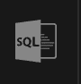
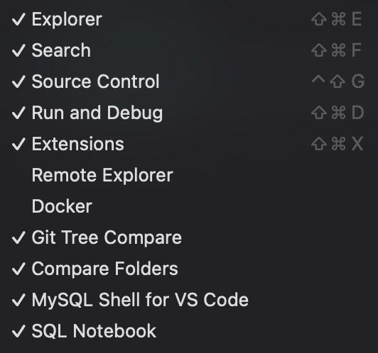
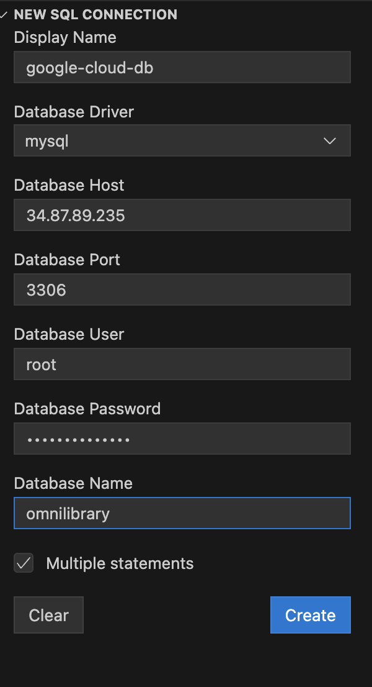
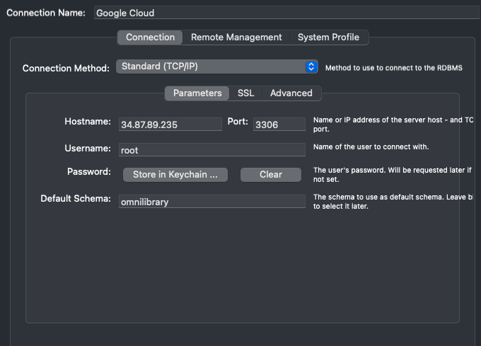
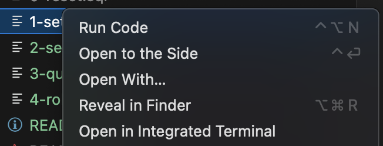
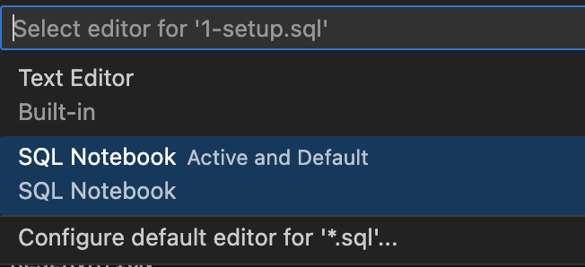

# How To Use

Go here for the DB scripts
https://github.com/azhar-ntu/in6205-database-sql

## Installation
1. Install [VS Code](https://code.visualstudio.com/download)
2. Install [SQL Notebook Plugin](https://marketplace.visualstudio.com/items?itemName=cmoog.sqlnotebook)

## Configuring Database Connection
Shared Database has been setup on Google Cloud

|  |  |
| ----------- | ----------- |
| Hostname | 34.87.89.235 |
| Port | 3306 |
| Username | root |
| Password | *********** |
| Database Name / Default Schema | omnilibrary |

### For SQL Notebook:
Look for the SQL Notebook icon in VS Code, if not there right click and check SQL Notebook

## For MySQL Workbench:
Click the plus button:

## Executing Queries

Right click open with SQL Notebook:

Click Run All or Run individual Cells:

1. Run [setup](1-setup.sql) to create the database schema
    * If running in MySQL Workbench, use [database-schema.sql](database-schema/database-schema.sql) instead 
    (Due to different syntax of DELIMITER for procedure and trigger)
2. Run [seed](2-seed.sql) to insert sample data to database
3. Run [query](3-query.sql) to run the demo queries
4. Run [rollback](4-rollback.sql) to reset the db so that demo can run again (eg reversing INSERT statement to prevent duplicate entry error)